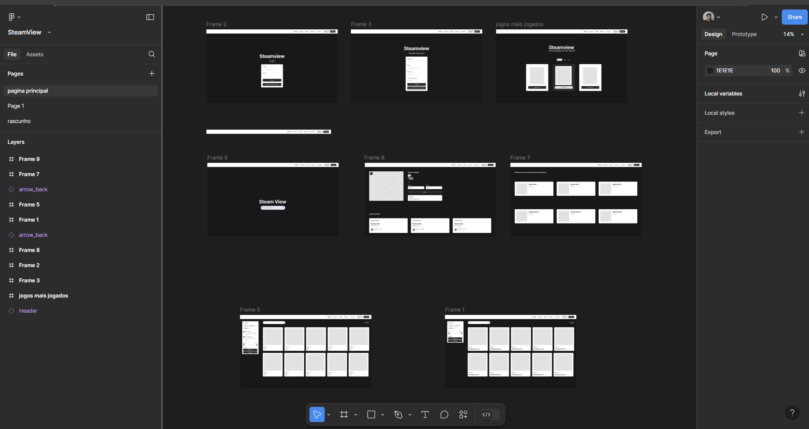
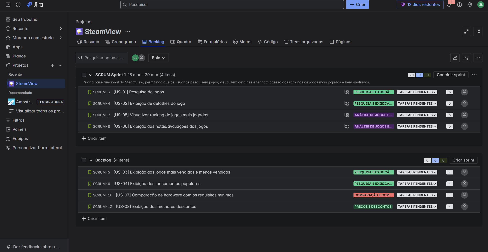
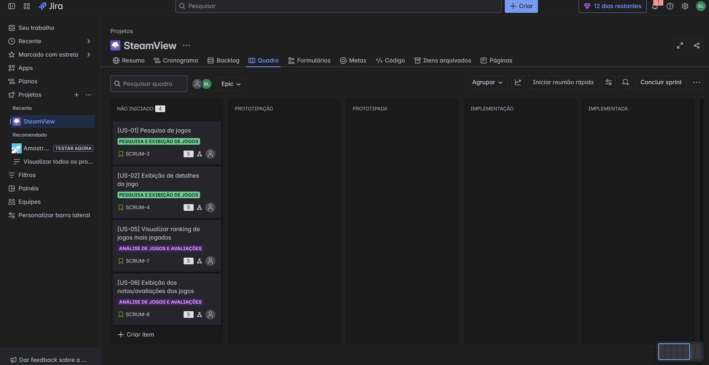
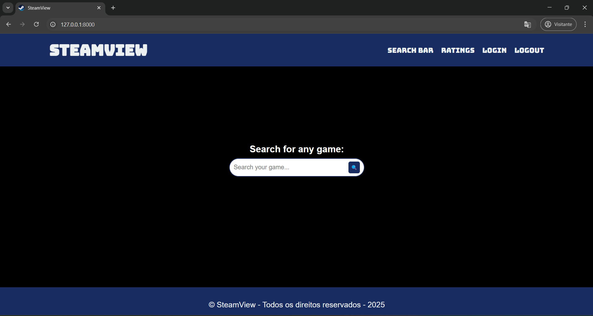
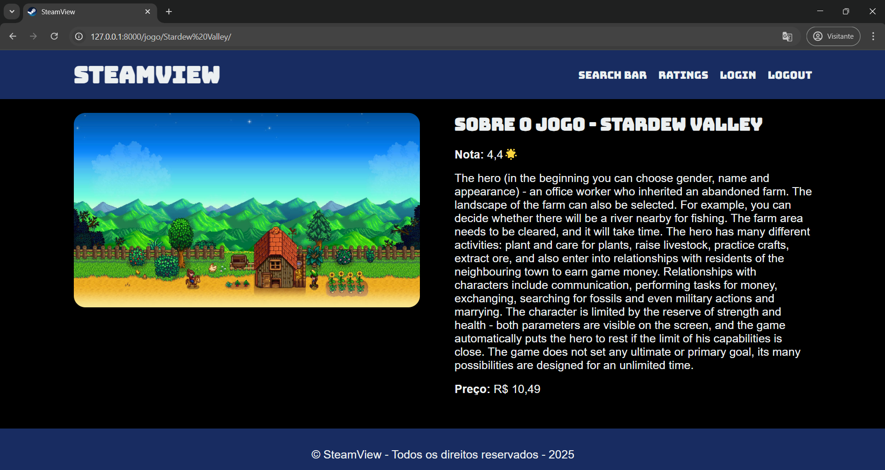
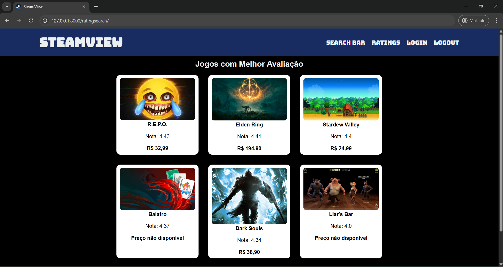
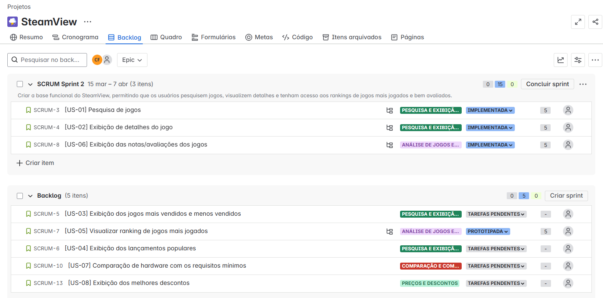
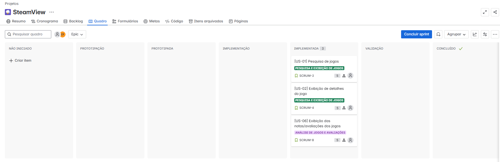
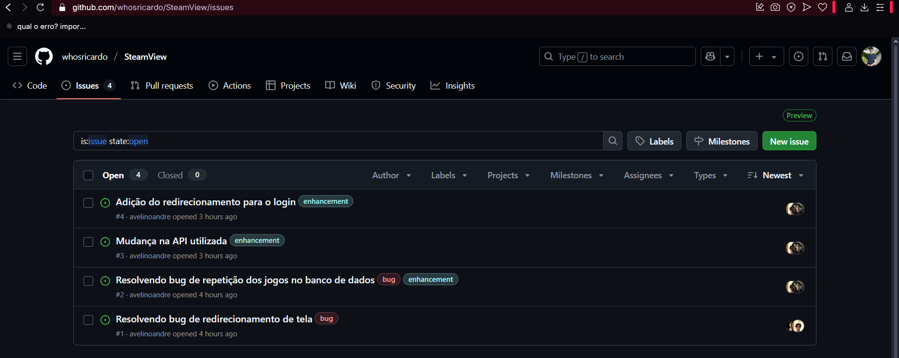

# SteamView

## 📖 Descrição
O SteamView é um software feito pelo framework Django, tem como objetivo ajudar jogadores que buscam analisar informações dos jogos da steam, como por exemplo, ver descontos em jogos, os jogos mais vendidos, os mais bem avaliados, requisitos de software, entre outros.

---

## 🧑‍💻 Tecnologias e Ferramentas
- framework Django: Django é um framework web em Python que permite o desenvolvimento rápido e seguro de aplicações, seguindo o padrão MVT. Ele inclui uma ORM poderosa, autenticação integrada e painel administrativo automático.
- Figma: Figma é uma ferramenta de design colaborativo baseada na web, usada para criar interfaces, protótipos e designs. Permite trabalho em tempo real, facilitando a colaboração entre equipes.
- Jira: O Jira é uma ferramenta para gerenciar tarefas e projetos, especialmente em equipes de software, usando metodologias ágeis.

---

🔗 LINKS IMPORTANTES

    
    
    
    
    

---

📝 PRIMEIRA ENTREGA

O objetivo deste sprint é estabelecer a infraestrutura inicial do sistema, com foco em funcionalidades essenciais para o gerenciamento de usuários. 

Será implementada a análise do ranking de jogos mais jogados, pesquisa específica do jogo desejado para saber mais sobre o mesmo, a comparação do meu hardware com os requisitos mínimos do jogo em questão. 

Também será possível analisar melhores descontos dos jogos, analisar as notas/avaliações dos jogos, analisar detalhes do jogo desejado, analisar lançamentos populares, analisar jogos mais e menos vendidos.

Juntamente com a entrega do layout das histórias criadas pelo Figma e atualização do backlog no Jira. Também criamos um Screencast, para apresentar o nosso protótipo de baixa fidelidade feito pelo figma, acesse  e um criamos um docs com as histórias para registrar as mesmas, acesse 

Juntamente com a entrega do layout das histórias criadas no Figma e a atualização do backlog no Jira, também produzimos um Screencast para apresentar nosso protótipo de baixa fidelidade desenvolvido no Figma. Você pode acessá-lo [clicando aqui](https://www.youtube.com/watch?v=4X-COxfohOs). Além disso, criamos um documento para registrar todas as histórias. Para acessá-lo, [clique aqui](https://docs.google.com/document/d/1S2g1G4RuujxoqrS3X8qtjB-jPXst8eDhbwKny189anE/edit?tab=t.0").

Nosso figma contem 8 telas que se resumem a login, cadastro, menu de pesquisa, rankings, promoções, avaliações, mais vendidos e sobre o jogo:

O jira ficou com a criação do backlog com atualização da primeira sprint, juntamente com o quadro com as infomações que serão atualizadas no futuro do projeto:

---

📝 SEGUNDA ENTRAGA 

O objetivo desta segunda sprint é começar a fazer o projeto de verdade, implementando nossas primeiras histórias de usuário na prática.

## Histórias implementadas:

1. Pesquisa de jogos, que permite ao usuário encontrar jogos específicos por meio do nome do jogo.

2. Exibição de detalhes dos jogos, permitindo que o usuário consiga ver mais informações a respeito do título pesquisado.

3. Exibição da avaliação dos jogos, o que permite ao usuário ter uma noção mais clara do feedback da comunidade a respeito de determinado jogo.

# Jira

Trouxemos uma atualização do backlog no Jira, que é por onde conseguimos gerenciar o andamento do projeto e organizar as demandas e histórias, onde implementamos essas 3 histórias.Para acessá-lo, [clique aqui](https://steamview.atlassian.net/jira/software/projects/SCRUM/boards/1/backlog?atlOrigin=eyJpIjoiNzkyMmY3OTcxZDQ0NDM2MWEwMjk5ZWQwYzZiOWU5OTEiLCJwIjoiaiJ9).

BackLog:

Board:

# Screencast
Além disso, trouxemos, desta vez, um screencast para apresentar o nosso projeto - agora já desenvolvido em Django. Você pode acessá-lo [clicando aqui](https://youtu.be/1OVcVGjYgdY). Além disso, criamos um documento para relatar como foram divididas as tarefas entre o grupo. Para acessá-lo, [clique aqui](https://steamview.azurewebsites.net/).

# Bugtracker
Fizemos a criação de um bugtracker, onde podemos ver a correção de bugs e melhorias no Steam View.

Bugs corrigidos:

1. Bug de redirecionamento de tela:

- Antes, o usuário era redirecionado de forma errada. Ele ia para uma tela onde era para aparecer o jogo antes de pesquisá-lo, o que, após essa correção, foi ajeitado e agora o usuário é direcionado primeiramente para a barra de pesquisa e depois para as informações do jogo.

2. Bug de repetição de jogos no banco de dados:

- O código, antes, não verificava se o jogo existia no banco de dados e o criava repetido. Agora ocorre a verificação e, caso não esteja, é criado no banco.

Melhorias:

1. Mudança na API atualizada:

- Alteração da API da Steam pela API da RAWG, com o intuito de melhorar a funcionalidade do site, já que a API da Steam se encontrava desatualizada, assim, não trazendo as informações solicitadas de jogos mais recentes ou trazendo informações desatualizadas.

2. Edição do redirecionamento para o login:

- Caso o usuário não esteja logado, é redirecionado automaticamente para a tela de login.

# Relatório

Criamos um documento para relatar como foram dividas as tarefas entre o grupo.Para acessá-lo, [clique aqui](https://docs.google.com/document/d/1kGRfZ-oWasivb5I1HcR4BfNv_ETWxWy5BHzKlodHNbM/edit?usp=sharing).

---

## 🫂 Integrantes
| Matricula  | Nome                                  | Email da school    |
| ---------- | ------------------------------------- | ------------------ |
| 2024200049 | André Avelino Freitas de Oliveira     | aafo@cesar.school  | 
| 2024200395 | Augusto Malheiros de Souza            | ams10@cesar.school | 
| 2024200040 | Caio Mathews de Farias Ferreira       | cmff@cesar.school  | 
| 2024200327 | Eduardo Albuquerque Alves Barbosa     | eaab@cesar.school  |
| 2024200393 | Gabriel Miranda Murcabel de Lima      | gmml@cesar.school  |
| 2024200124 | Ricardo Sérgio de Paula Freitas Filho | rspff@cesar.school |

